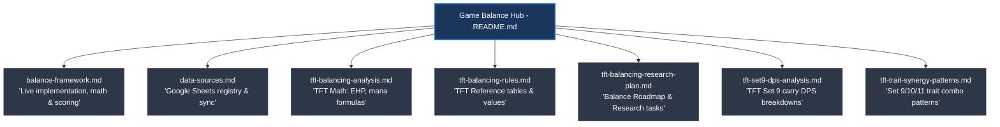
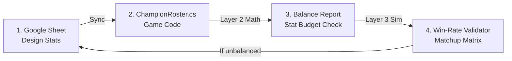

# Game Balance Hub

Welcome to the balancing documentation hub for the Custom Auto-Battler. This directory contains our math, simulations, and reference data. 

Use this guide to find the right document depending on your task.

---

## 🗺️ Documentation Map

Start here if you want to understand how our balancing system is structured:

### 📄 Document Directory

| Document | Purpose / What's inside | When to read it |
| :--- | :--- | :--- |
| **[Balance Framework](file:///c:/Organized%20Files/Working/Unity/Unity%20Project/Magic%20School/.claude/docs/balance/balance-framework.md)** | **Live design truth.** Explains the 3-step balance process, the Attack Speed Accumulator, the Mana-on-Hit system, and the target Stat Budget Scores. | Read this before making stat or mechanical adjustments to any champion. |
| **[TFT Balancing Rules & Reference Guidelines](file:///c:/Organized%20Files/Working/Unity/Unity%20Project/Magic%20School/.claude/docs/balance/tft-balancing-rules.md)** | **Compact reference tables.** Contains target durability/EHP ranges by gold tier, attack speed splits, and star-level scaling multipliers from Teamfight Tactics. | Read this for quick numeric benchmarks when designing new units or traits. |
| **[TFT Stats and Balancing Analysis](file:///c:/Organized%20Files/Working/Unity/Unity%20Project/Magic%20School/.claude/docs/balance/tft-balancing-analysis.md)** | **The mathematical "why."** A deep dive into League of Legends/TFT math: EHP calculations, pre-mitigation mana-on-hit formulas, tick quantization, and cost scaling. | Read this to understand the underlying theory and reasons behind our math. |
| **[TFT Set 9 Carry DPS Analysis](file:///c:/Organized%20Files/Working/Unity/Unity%20Project/Magic%20School/.claude/docs/balance/tft-set9-dps-analysis.md)** | **Consolidated Carry breakdowns.** Groups carrying analyses for all five tiers (Tier 1 through Tier 5) of carry champions, detailing auto-attack and spell-cycle DPS (normal vs. spell contribution) across star levels. | Read this when reviewing raw power scaling curves, caster vs. physical carry dynamics, resets, spins, and projectile splits. |
| **[TFT Balancing Research Roadmap](file:///c:/Organized%20Files/Working/Unity/Unity%20Project/Magic%20School/.claude/docs/balance/tft-balancing-research-plan.md)** | **Long-term research plan.** Tracks our progress across topics like Trait Synergy, Ability Scaling, Team Combat Simulation, Itemization, and Economy. | Read this to check what balance tasks are coming next or need research. |
| **[Balance Data Sources](file:///c:/Organized%20Files/Working/Unity/Unity%20Project/Magic%20School/.claude/docs/balance/data-sources.md)** | **Google Sheets registry.** Outlines our live sheets (`auto-battler`, `tft-set9`, `tft-set10`, `tft-set11`) and details the CLI commands to sync or dump data. | Read this when you need to sync Google Sheet data or work with offline snapshots. |
| **[TFT Trait Synergy & Meta-Comp Patterns](file:///c:/Organized%20Files/Working/Unity/Unity%20Project/Magic%20School/.claude/docs/balance/tft-trait-synergy-patterns.md)** | **Cross-set comp analysis.** How many traits a real meta comp activates, how hard each is pushed, and the combo shape Riot actually builds around, across Set 9/10/11. | Read this before curating or reviewing our own meta comps, or when tuning trait breakpoints. |

---

## 🔄 Balancing Workflow

Our game uses a combination of **static math** (spreadsheet-driven) and **dynamic simulation** (combat runner) to keep the roster balanced. 

### Useful CLI Commands & Workflows
All commands are run using Claude Code (or helper scripts) and the `auto-battler` Google Sheet:
*   **`/check-balance`** — Checks the consistency between the Google Sheet and game code, runs Layer 2 Stat Budget Score check, and flags out-of-band champions.
*   **`/tune-champion`** — Suggests stat changes for an out-of-band champion until their math fits their cost tier.
*   **`/validate-balance`** — Runs 200 rapid 1v1 battles inside Unity for all matchup pairs to detect win-rate outliers.
*   **`/push-champion-stats`** — Syncs local stat changes back up to the Google Sheet.
