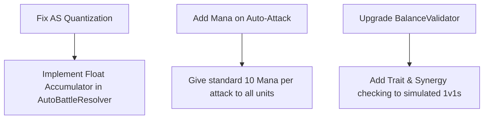

# TFT Stats and Balancing Analysis

This document provides a deep dive into the mathematical mechanics of stats in Teamfight Tactics (TFT) by Riot Games, compares them to our custom auto-battler's mechanics, and outlines how we can apply these balancing techniques.

> **Scope**: TFT research and proposed refinements. For how these mechanics are implemented in this project, see `balance-framework.md`.

---

## 1. Core TFT Stat Mathematics

In auto-battlers, player input is limited to pre-battle team formulation, positioning, and economy management. Once the battle starts, the game executes a deterministic or semi-random simulation. Because of this, balancing is fundamentally a mathematical optimization problem.

### Health, Armor, and Magic Resist (Effective Health Pool - EHP)

#### What is EHP?
**Effective Health Pool (EHP)** represents the *actual* amount of raw, pre-mitigation damage a unit must take from enemies before it is defeated. 

While a unit's visual health bar shows its base **HP**, damage mitigation (like Armor and Magic Resist) reduces incoming damage, making each point of actual HP survive longer. EHP mathematically combines base HP and defense stats into a single value representing the unit's true durability.

For example, if a unit has **1,000 HP** and **50% damage reduction**:
* It only takes **50 damage** from a **100-damage raw attack**.
* To defeat this unit, enemies must inflict a total of **2,000 raw damage** (since only half goes through).
* Thus, its **Effective Health Pool (EHP)** is **2,000**.

#### The Math
TFT calculates damage mitigation using the League of Legends style defense formula.

$$\text{Damage Multiplier} = \frac{100}{100 + \text{Defense}}$$

$$\text{Damage Taken} = \text{Raw Damage} \times \text{Damage Multiplier}$$

This formula is designed to prevent defensive stats from making a unit immune to damage. Instead, it scales **Effective Health Pool (EHP)** linearly, but physical and magic durability are calculated completely separately:

For Physical attacks (reduced by Armor):
$$\text{EHP}_{\text{physical}} = \text{HP} \times \left(1 + \frac{\text{Armor}}{100}\right)$$

For Magic attacks/spells (reduced by MR):
$$\text{EHP}_{\text{magic}} = \text{HP} \times \left(1 + \frac{\text{MR}}{100}\right)$$

Note that Physical and Magic EHP are entirely separate pools. A unit with 200 Armor but 0 MR will have 3,000 physical EHP but only 1,000 magic EHP.

> [!NOTE]
> Every **1 point of Armor/MR** increases a unit's durability against that damage type by **exactly 1% of its base Health**. 
> * A unit with 1,000 HP and 0 Armor has **1,000 physical EHP**.
> * A unit with 1,000 HP and 100 Armor has **2,000 physical EHP** (takes 50% damage).
> * A unit with 1,000 HP and 200 Armor has **3,000 physical EHP** (takes 33.3% damage).

#### Balancing Implication
When choosing between tuning a champion's HP or Armor/MR:
* **Increasing HP** increases durability against *both* physical and magic damage, and amplifies flat shields or %-HP healing.
* **Increasing Armor/MR** increases durability against only one damage type, and makes healing or shielding *more valuable per point healed* (since each point of health is worth more effective health).

---

### Attack Damage (AD) and Attack Speed (AS)
In TFT, auto-attack DPS (before mitigation) is represented by:

$$\text{Base Attack DPS} = \text{AD} \times \text{AS}$$

* **AD** is a flat number representing damage per attack. It multiplies by exactly **1.8×** per star-level upgrade (1-star to 2-star, and 2-star to 3-star).
* **AS** is a float representing attacks per second. When an item or trait grants "+30% Attack Speed," it is always an additive bonus calculated on the *base* AS:
  $$\text{Current AS} = \text{Base AS} \times (1 + \text{Bonus AS}\%)$$

#### The Tick Quantization Challenge
In a digital game engine, time is split into discrete frames or server ticks.
* TFT runs its simulation at **10 ticks per second** (0.1s tick rate).
* A unit's attack interval in ticks is calculated by dividing the tick rate by the attack speed, rounding to the nearest tick.
* Our project runs at a much slower tick rate of **1.67 ticks per second** (0.6s tick delay).

Let's examine how our current rounding formula behaves:
$$\text{ActionInterval} = \max\left(2, \text{round}\left(\frac{1.0}{\text{AttackSpeed} \times 0.6}\right)\right)$$

| Attack Speed | Target Interval (s) | Calculated Ticks | Actual Interval (s) | True Attack Speed |
| :--- | :--- | :--- | :--- | :--- |
| **0.21** (Ironclad) | 4.76s | **8** | 4.80s | 0.208 |
| **0.24** (Dread Overlord) | 4.17s | **7** | 4.20s | 0.238 |
| **0.28** (Pyromancer) | 3.57s | **6** | 3.60s | 0.278 |
| **0.33** (Bloodhound) | 3.03s | **5** | 3.00s | 0.333 |
| **0.42** (Windrunner) | 2.38s | **4** | 2.40s | 0.417 |
| **0.56** (Shadowblade) | 1.79s | **3** | 1.80s | 0.556 |

> [!WARNING]
> Because our tick interval (0.6s) is so large, rounding causes massive **"dead zones"** and **"breakpoints"**.
> For example:
> - If Pyromancer (0.28 AS) receives a **+10% AS** buff, its AS becomes **0.308**.
> - The formula yields: $1 / (0.308 \times 0.6) = 5.41$, which rounds to **5 ticks**. That drops its attack time from 3.6s to 3.0s (a **16.7% DPS increase**!).
> - If it received a **+5% AS** buff instead, its AS becomes **0.294**. The formula yields $1.13 / 0.176 = 5.66$, which rounds to **6 ticks**. The buff has **0% actual effect**.
>
> In TFT (0.1s ticks), an attack interval might drop from 11 ticks to 10 ticks, representing a minor 9% increase. In our game, going from 3 ticks to 2 ticks is a **50% increase**.

---

### Mana and the Ability Cycle
TFT champions gain mana through active participation in combat:
1. **Attacking**: A flat **10 mana** per auto-attack.
2. **Defending (Mana-on-Hit)**: **7% of pre-mitigation damage taken** is converted into mana.
   * **What is pre-mitigation damage?** This is the raw damage of the attack *before* it is reduced by Armor, MR, or active shields. 
     - *Why use pre-mitigation?* If mana gain scaled with *post-mitigation* (actual HP lost) damage, a heavily-armored tank with 300 Armor (75% damage reduction) would gain 4× less mana than a squishy carry when hit by the same attack. This would prevent tanks from ever casting their abilities. By using pre-mitigation damage, both tanks and carries gain the exact same amount of mana when struck by a specific enemy attack.
   * **The Cap per Instance of Damage**: To prevent a champion from immediately reaching maximum mana from a single massive hit (e.g. taking 1,500 damage from a high-tier spell, which would translate to $1,500 \times 0.07 = 105$ mana), Riot caps the maximum mana gained from a single instance of damage to exactly **42.5 mana** (which is hit when taking 607 or more raw damage). This prevents runaway cast loops and prevents hyper-tanks with shields from spamming abilities infinitely.
3. **Traits/Items**: E.g., Scholar, Invoker, Blue Buff, Shojin.

When mana reaches the Max Mana threshold, the champion halts auto-attacking to cast their ability, and their mana resets to 0.

#### Balancing Implication
Riot uses **Max Mana** and **Starting Mana** as primary dials:
* **Starting Mana** controls how quickly a unit gets their first cast. High starting mana (e.g., 90/100) is placed on crowd-control tanks (like Sejuani or Cho'Gath) so they disrupt the board early.
* **Max Mana** determines the cycle time. A spammer carry (like Ryze or Ezreal) might have a 0/40 mana pool, casting every 4 attacks. A high-impact hyper-carry (like Karthus or Gangplank) might have 0/120, requiring long windups.

---

### Critical Strike Chance & Damage
* Base Stats in TFT: **25% Crit Chance** and **140% Crit Damage** (deals +40% bonus damage).
* **Crit Overflow**: If a unit's Crit Chance exceeds 100% (via items like Infinity Edge or Jeweled Gauntlet), every 1% of excess Crit Chance is converted into **+1% Crit Damage**.
  $$\text{Final Crit Damage} = 140\% + (\text{Crit Chance} - 100\%)$$

---

## 2. Applying Balancing Techniques to Our Game

We currently balance our game using a **3-Layer Balance Framework** (detailed in `balance-framework.md`). Here is how we can refine it using TFT concepts.

### Layer 1 Refinement: Fixing Attack Speed Quantization
To eliminate the rounding cliffs in our tick-based system without changing the tick delay (which would ruin visual pacing), we should shift from a **subtracted timer** to an **accumulator system**.

#### Proposed Accumulator Logic
Instead of decrementing an integer `ActionTimer` each tick:
1. Each unit has a float `ActionProgress` that starts at `0.0f`.
2. Each tick, we add the unit's progress rate:
   $$\text{ProgressPerTick} = \text{AttackSpeed} \times \text{TickDelay}$$
3. When `ActionProgress >= 1.0f`, the unit attacks, and we decrement the progress:
   $$\text{ActionProgress} -= 1.0f$$

Let's see how this fixes the Pyromancer (0.28 AS) with different buffs:
* **Base (0.28 AS)**: Adds $0.28 \times 0.6 = 0.168$ progress per tick.
  - Tick 1: 0.168
  - Tick 2: 0.336
  - Tick 3: 0.504
  - Tick 4: 0.672
  - Tick 5: 0.840
  - Tick 6: 1.008 $\rightarrow$ **Attacks!** Remaining: 0.008.
  - Average interval: **6.0 ticks**.
* **+5% Buff (0.294 AS)**: Adds $0.294 \times 0.6 = 0.1764$ progress per tick.
  - Tick 6: 1.0584 $\rightarrow$ **Attacks!** Remaining: 0.0584.
  - Tick 12: 1.1168 $\rightarrow$ **Attacks!** Remaining: 0.1168.
  - Tick 17: 1.0008 $\rightarrow$ **Attacks!** Remaining: 0.0008 (takes 5 ticks this cycle!).
  - Over 100 ticks, it attacks 17 times (average **5.88 ticks**). The +5% buff now works smoothly over time instead of being completely wasted!

---

### Layer 2 Refinement: The Stat Budget Score
Our current formula is:
$$\text{Score} = \text{Offense} \times \text{AttackSpeed} \times \sqrt{\text{HP} \times \frac{100 + \text{DEF}}{100}}$$

$$\text{Score} = \text{DPS} \times \sqrt{\text{EHP}}$$

#### Why $\sqrt{\text{EHP}}$ is Used
If we used pure $\text{DPS} \times \text{EHP}$ (which is a unit's theoretical duel power in a vacuum), tanks would score excessively high because of their massive EHP.
However, in team combat, a tank's damage output is rarely focused on carries, and they are prone to being CC'd or ignored. Carries deal damage from safety. Taking the square root of EHP reduces the weight of raw health and armor, balancing the score to represent a unit's true utility in a dynamic team fight.

#### Standardizing Tier Budgets
To keep champions balanced as they scale in cost (1c to 5c), we can use the **TFT Cost Scaling Law**:
* A higher-cost champion should offer approximately **15% to 25% more stat budget** per gold level.
* However, their scaling is also driven by **ability impact** and **trait synergies** rather than just raw numbers (e.g., Dread Overlord is a 5-cost tank because he blinks into the backline, not just because he has high health).

---

### Layer 3 Refinement: Expansion of the Simulation Matrix
Our current `BalanceValidator.cs` only runs base-stat 1v1 matchups.
To truly apply TFT balancing techniques, we must test:
1. **Synergy Matchups**: Run $4 \times 4$ simulations with active traits (e.g., Vanguard-Warden team vs Striker-Dreadknight team) to see if synergies blow out the balance bands.
2. **Combat Variance (CRIT)**:
   - Check standard deviation of win rates.
   - If CRIT is set to `true`, does it cause 1-cost carries to randomly beat 3-cost carries too often? If so, the base crit rate or crit damage multiplier must be lowered.

---

## 3. Practical Recommendations for SwiftkeyX/Magic-Tutor

To apply these techniques directly in the code, here is an action plan:

1. **Modify `AutoBattleResolver.cs` to use an Accumulator** (find the `ActionTimer` decrement block in `BattleLoop`):
   Replace the integer `ActionTimer` decrement with a float addition of `AttackSpeed * TickDelay` to make attack-speed buffs (like Striker or Ranger) scale linearly instead of stepping off cliffs.
   
2. **Standardize Mana Generation**:
   Instead of Kinetic being the *only* source of mana, let all units gain 10 mana on attack. When they reach 100, trigger their spell/bonus action. The Kinetic trait can then boost this rate (e.g., +5 mana per tick or +5 per attack).

3. **Incorporate EHP/DPS validation directly into the spreadsheet**:
   We can write a script or update `sheet_sync.py` to auto-calculate the **Layer 2 Stat Budget Score** for every champion whenever we edit their stats, highlighting if they exceed their tier's allowed budget.
